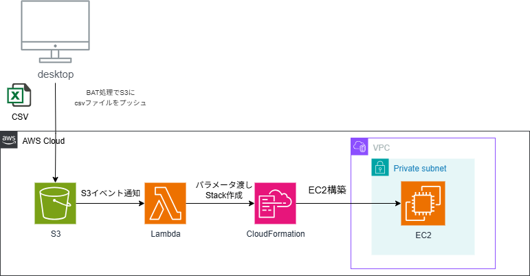

# CSV-to-EC2

CSVファイルを使用してAWS EC2インスタンスを自動プロビジョニングするサーバーレスアプリケーション

## 概要

単純なCSVファイルをS3にアップロードするだけで、AWS上にEC2インスタンスを自動的に構築・設定するサーバーレスアプリケーションです。

### 特徴
- サーバーレスアーキテクチャ（S3 + Lambda）
- IaC（AWS SAM）によるインフラ管理
- プライベートサブネットとSSMによるセキュアな設計
- EC2の構築から設定までを自動化

<p align="center">
  
</p>

## アーキテクチャ


## 要件
- AWS CLI
- SAM CLI
- Python 3.11

## セットアップ
```bash
# リポジトリのクローン
git clone https://github.com/RT-art/csv-to-ec2.git
cd csv-to-ec2

# デプロイ
sam build
sam deploy --guided
```

## 使用方法
1. CSVファイルを作成：
```csv
StackName,Action,InstanceType,AmiId,HostName
ec2-web-01,create,t2.micro,ami-0123456789abcdef0,WEB01
```

2. S3にアップロード：
```bash
aws s3 cp sample.csv s3://<YOUR-BUCKET-NAME>/
```

詳細な説明は[Qiitaの記事]()を参照してください。