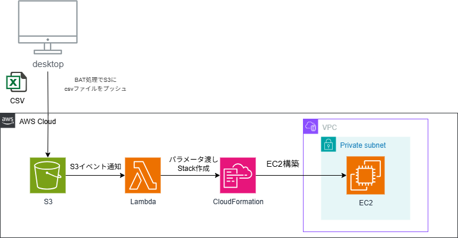

# CSVファイルからEC2を自動構築するシステム

## 概要

このシステムは、サーバーのスペックなどを記述した**CSVファイル**を特定の場所にアップロードするだけで、自動的にAWS上に**EC2サーバー**を構築します。

専門的な知識がなくても、使い慣れた表計算ソフトでCSVファイルを準備するだけでサーバーを構築できる、**非エンジニアにもやさしい構成**です。

---

## アーキテクチャ図

このシステムの全体像は以下の通りです。

  

---

## 処理の流れ

1.  **CSVアップロード** 📂
    ユーザーPCからCSVファイルをS3（ファイルの保管場所）にアップロードします。
    ユーザーは、csvファイルを編集し、batを叩くだけです。

2.  **Lambda起動** ⚡
    ファイルのアップロードを検知して、自動的にLambda（小さなプログラム）が起動します。

3.  **パラメータ読み取り** 📝
    LambdaはCSVファイルの中身（サーバー名やOSの種類など）を読み取ります。

4.  **CloudFormationへ指示** 🗣️
    読み取った情報を基に、CloudFormation（設計図からインフラを作るサービス）へ「こういうサーバーを作って」と指示を出します。

5.  **EC2サーバー構築** 🖥️
    CloudFormationが指示通りに、EC2サーバーを構築します。

---

## 主な特徴

* **サーバーレス**: 自動化を動かすための管理サーバーは不要です。
* **完全自動化**: ファイルをアップロードすれば、あとは何もしなくてもサーバーが完成します。
* **コスト効率**: ファイルがアップロードされた時だけ処理が動くため、無駄なコストがかかりません。
* **設定が簡単**: サーバーのスペックは、使い慣れたCSV形式で管理できます。