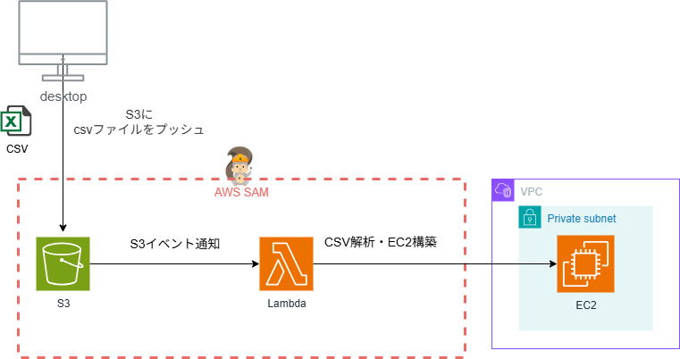

# サーバーレスEC2プロビジョニング from CSV ✨

CSVファイルに基づき、EC2インスタンスを自動で作成するAWS SAMアプリケーションです。

## 🏛️ アーキテクチャ



-----

## 🚀 使い方

### **前提条件**

* [AWS CLI](https://aws.amazon.com/cli/) と [AWS SAM CLI](https://docs.aws.amazon.com/serverless-application-model/latest/developerguide/serverless-sam-cli-install.html) がインストールされていること。
* AWS認証情報が設定済みであること (`aws configure`)。

-----

### **Step 1: デプロイ (初回のみ)**

最初に、AWS環境に必要なリソース一式（VPC, S3バケット, Lambda関数など）をデプロイします。この操作は一度だけ行います。

1.  **スクリプトに実行権限を付与します。**

    ```bash
    chmod +x manage.sh
    ```

2.  **デプロイコマンドを実行します。**

    ```bash
    ./manage.sh deploy
    ```

    CloudFormationスタックの作成が完了すれば、環境の準備は完了です。

-----

### **Step 2: EC2インスタンスの作成**

1.  **CSVファイルを用意します。**
    `sample.csv` を参考に、作成したいEC2インスタンスの情報を記述します。

    * `ami_id` と `instance_type` の列は**必須**です。
    * 作成されるすべてのインスタンスには、**デフォルトでSSMセッションマネージャーが利用可能になる権限が付与されます。**

2.  **CSVファイルをアップロードしてインスタンスを作成します。**
    `upload` コマンドを実行すると、Lambda関数がトリガーされ、CSVの内容に基づいてEC2インスタンスが自動で作成されます。

    * **【推奨】CSVファイルが1つだけの場合**
        カレントディレクトリにCSVファイルが1つだけ存在する場合、ファイル名を指定しなくても自動で検知してアップロードします。

        ```bash
        # カレントディレクトリにある唯一的の.csvファイルをアップロード
        ./manage.sh upload
        ```

    * **特定のファイルを指定する場合**
        複数のCSVファイルがある場合や、特定のファイルを指定したい場合は、ファイル名を引数として渡します。

        ```bash
        # my_instances.csv を指定してアップロード
        ./manage.sh upload my_instances.csv
        ```

-----

### **Step 3: クリーンアップ 🗑️**

このアプリケーションで作成したすべてのAWSリソースを削除するには、以下のコマンドを実行します。

```bash
./manage.sh delete
