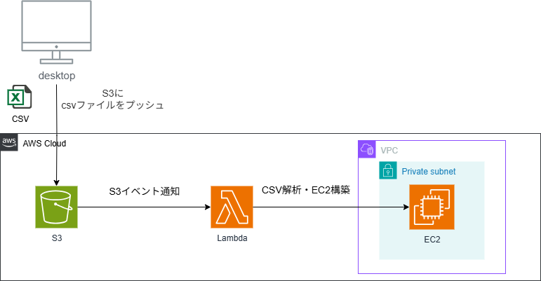

# CSV to EC2 Creator

S3にCSVファイルをアップロードするだけで、EC2インスタンスを自動的にプロビジョEニングするイベント駆動型サーバーレスアプリケーションです。手作業によるEC2インスタンスの立ち上げを完全に自動化し、ワークフローを劇的に効率化します。

## ✨ アーキテクチャ



## 🌟 特徴

- **Infrastructure as Code (IaC) with AWS SAM**:
  AWS SAM (Serverless Application Model) を使用し、S3バケット、Lambda関数、IAMロールといった全てのインフラリソースをコードで管理します。

- **Event-Driven Architecture**:
  S3へのCSVファイルアップロードをトリガーとしてLambda関数が自動起動する、無駄のない効率的な設計です。

- **Automated EC2 Provisioning**:
  CSVファイルをS3に置くだけで、手動でのコンソール操作は一切不要です。複数のインスタンスも一度にまとめて作成できます。

- **Full CI/CD Pipeline Support**:
  AWS CodePipelineとCodeBuildを組み合わせることで、GitHubへのプッシュをトリガーに自動ビルド・デプロイを行うCI/CDパイプラインを簡単に構築できます。

---

## 🛠️ 前提条件

本プロジェクトをデプロイ・実行するには、以下のツールが必要です。

- AWSアカウント
- [AWS CLI](https://aws.amazon.com/cli/)
- [AWS SAM CLI](https://docs.aws.amazon.com/serverless-application-model/latest/developerguide/serverless-sam-cli-install.html)
- EC2インスタンスをデプロイしたい既存のVPCとサブネット

---

## 🚀 デプロイ

このプロジェクトをAWSアカウントにデプロイする手順です。
`template.yaml`に定義されたS3バケット、Lambda関数、および関連するIAMロールが作成されます。

### SAMアプリケーションのビルドとデプロイ

以下のコマンドを実行し、SAM CLIのガイドに従って設定を進めてください。

```bash
# SAMアプリケーションをビルド
sam build

# ガイドに従ってデプロイを実行
sam deploy --guided
```

`sam deploy --guided`の実行中に、以下の設定を推奨します。

-   **Stack Name**: `csv-to-ec2-app-stack`
-   **AWS Region**: `ap-northeast-1` など
-   **Confirm changes before deploy**: `y`
-   **Allow SAM CLI IAM role creation**: `y`
-   **Disable rollback**: `y`
-   **Save arguments to configuration file**: `y`

### S3バケット名の確認

デプロイが完了すると、コンソールのOutputsセクションにS3バケット名が表示されます。このバケット名を控えておいてください。

---

## ⚙️ 使い方

### 1. CSVファイルの準備

プロビジョニングしたいEC2インスタンスの情報をCSVファイルに記述します。ヘッダーは必ず `subnet_id`, `ami_id`, `instance_type` としてください。

**`instances.csv`の例:**
```csv
subnet_id,ami_id,instance_type
subnet-xxxxxxxxxxxxxxxxx,ami-0c55b159cbfafe1f0,t2.micro
subnet-xxxxxxxxxxxxxxxxx,ami-0c55b159cbfafe1f0,t3.small
```

- **subnet_id**: EC2をデプロイするサブネットのIDを指定します。
- **ami_id**: 使用するリージョンに合ったAMI IDを指定します。
- **instance_type**: インスタンスタイプを指定します。

### 2. S3バケットへのCSVアップロード

作成したCSVファイルを、デプロイ時に作成されたS3バケットにアップロードします。

```bash
# <YOUR-BUCKET-NAME>を sam deploy のアウトプットで確認したバケット名に置き換えてください
aws s3 cp instances.csv s3://<YOUR-BUCKET-NAME>/
```

アップロードが完了すると、S3イベントがLambda関数を自動的にトリガーし、CSVの内容に基づいてEC2インスタンスが作成されます。

### (Optional) 新しいネットワーク環境の作成

EC2をデプロイするためのVPCやサブネットがない場合は、付属のCloudFormationテンプレートを使って新しいネットワーク環境を構築できます。

```bash
aws cloudformation deploy \
  --template-file awsnetwork.yaml \
  --stack-name csv-to-ec2-network-stack \
  --parameter-overrides VpcCidr=10.0.0.0/16 PrivateSubnetCidr=10.0.1.0/24
```

デプロイ完了後、以下のコマンドで `PrivateSubnetId` を取得し、CSVファイルに記述してください。

```bash
aws cloudformation describe-stacks \
  --stack-name csv-to-ec2-network-stack \
  --query "Stacks[0].Outputs[?OutputKey=='PrivateSubnetId'].OutputValue" \
  --output text
```

---

## 🧹 クリーンアップ

デプロイしたリソースを削除するには、以下のコマンドを実行します。

```bash
# アプリケーションスタックの削除
sam delete --stack-name csv-to-ec2-app-stack

# (Optional) ネットワークスタックを作成した場合のみ実行
aws cloudformation delete-stack --stack-name csv-to-ec2-network-stack
```

---

## 📄 コードとしてのインフラ (Infrastructure as Code)

このプロジェクトのインフラは、以下のAWSテンプレートで定義されています。

- **template.yaml**: アプリケーションのコアロジックを定義するAWS SAMテンプレートです。
- **buildspec.yml**: AWS CodeBuildでアプリケーションのビルドとデプロイを実行するための手順を定義します。
- **pipeline.yaml**: AWS CodePipelineによるCI/CDパイプラインを定義するCloudFormationテンプレートです。
- **awsnetwork.yaml**: (オプション) VPCやサブネットなどのネットワークインフラを定義します。